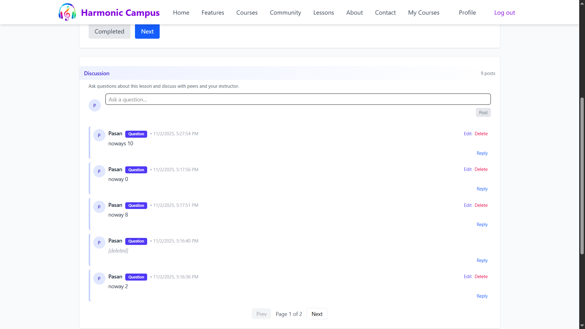
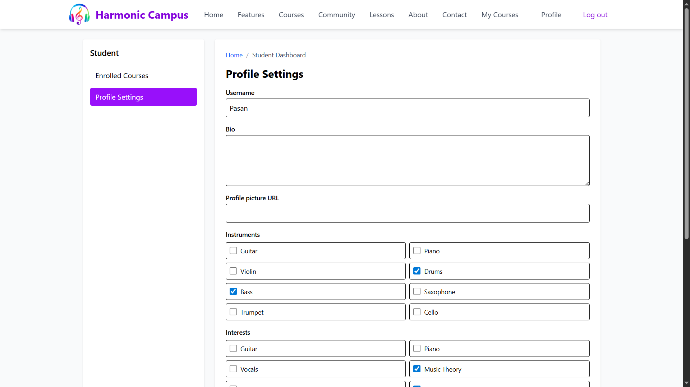
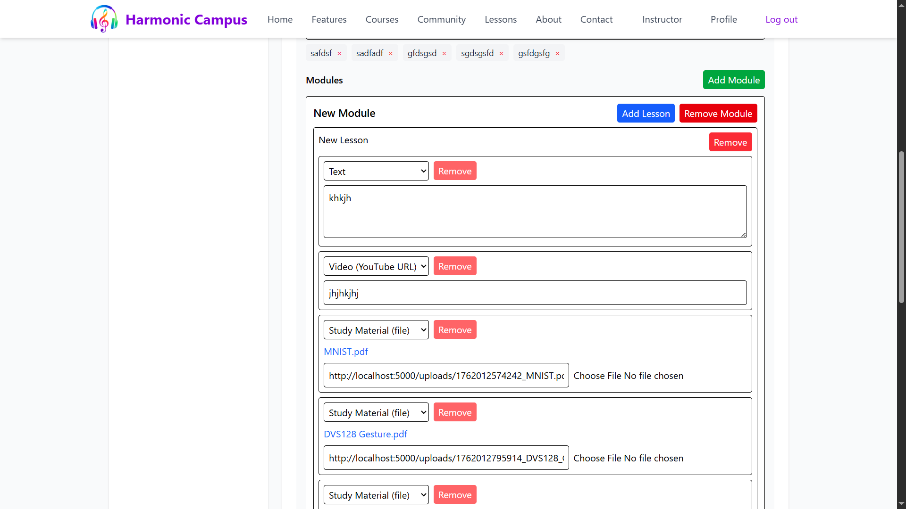
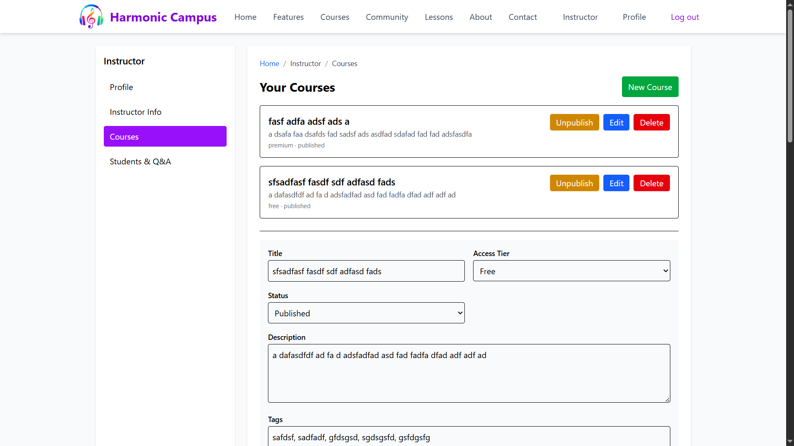
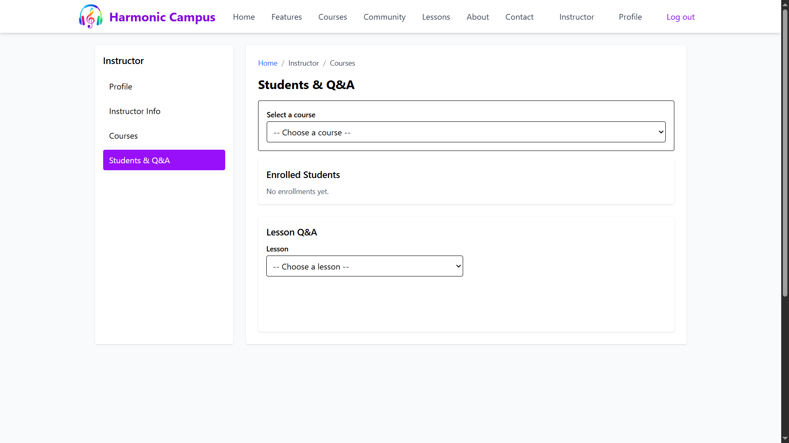

<div align="center">

# Harmonic Campus — Frontend

An interactive learning platform for music students and instructors. This React + TypeScript app powers browsing and managing courses, enrolling and tracking progress, lesson playback, lesson Q&A, and a community discussion board. Authentication is handled with Firebase; the app talks to a separate backend via REST.

</div>

## Table of Contents

- Overview
- screenshots
- Features
- Tech Stack
- Getting Started
- Environment Variables
- Scripts
- Project Structure
- Architecture
- Development Notes
- Deployment
- Troubleshooting

## Overview

Harmonic Campus is a music education platform. This frontend provides:

- A marketing landing page with sections for features, lessons, testimonials, about, and contact.
- A course catalog with search, tag and access-tier filters, enroll/unenroll, and detail pages.
- Role-based dashboards for students and instructors.
- A lesson player with text, video, and downloadable study materials, plus Q&A per lesson.
- A global community forum for open discussions.

The app relies on a backend API (configurable via `VITE_API_BASE_URL`) and Firebase for authentication.

## Screenshots

|  |  |
|---|---|
|  |  |
|  |  |
|  |  |

## Features

- Auth
  - Email/password signup and login via Firebase.
  - Google sign-in for login and signup flows.
  - Application user records synced to the backend (created on signup, or on first login if missing).

- Courses
  - Catalog with search, tag, access tier (free/premium) and sort options.
  - Enroll/Unenroll with premium-gated enrollments (backend can return 402 to trigger subscription UX).
  - Course detail page with module/lesson breakdown and study materials.
  - “My Courses” view and a “Continue where you left off” modal after login.

- Learning
  - Student course outline highlighting the next lesson.
  - Lesson player supporting content items: rich text, videos, and file downloads.
  - Progress tracking: mark a lesson complete/incomplete; next-lesson navigation.
  - Lesson-level Q&A with nested replies, editing and deletion (with moderation rules enforced by backend).

- Community
  - Global threads list with search and pagination.
  - Thread detail with nested replies, edit/delete for authors, collapse/expand on long threads.

- Instructor Dashboard
  - Profile/instructor information editing.
  - Course management: create, edit, publish/unpublish, delete.
  - Rich course editor: modules, lessons, and per-lesson content (text, video URL, uploaded files).
  - Enrolled students list per course and lesson Q&A monitoring.

- Profile & Personalization
  - Profile settings for username, bio, picture, instruments, and interests.
  - Tailwind CSS-based responsive UI with a fixed navbar and smooth hash scrolling.

## Tech Stack

- React 19 + TypeScript
- Vite 7 (dev/build/preview)
- React Router 7
- Tailwind CSS v4 (via `@tailwindcss/vite`)
- Firebase v12 (Auth)
- Axios (HTTP client)
- ESLint (TypeScript + React rules)

Note: `@reduxjs/toolkit` and `react-redux` are available but not currently utilized in the app state flow.

## Getting Started

Prerequisites:

- Node.js 18+ (recommended 18 or 20)
- A Firebase project (Web App) for Authentication
- The backend API running and reachable (see `VITE_API_BASE_URL`)

Install dependencies:

```powershell
npm install
```

Create a `.env.local` with your environment values (see below), then run the dev server:

```powershell
npm run dev
```

The app starts on a Vite dev server (default `http://localhost:5173`).

## Environment Variables

Place these in `frontend/.env.local` (Vite only exposes variables prefixed with `VITE_`).

```dotenv
# Backend REST API base URL (no trailing slash)
VITE_API_BASE_URL=http://localhost:5000

# Firebase Web App config (from Firebase Console > Project settings > General)
VITE_FIREBASE_API_KEY=your_api_key
VITE_FIREBASE_AUTH_DOMAIN=your-project.firebaseapp.com
VITE_FIREBASE_PROJECT_ID=your-project-id
VITE_FIREBASE_STORAGE_BUCKET=your-project.appspot.com
VITE_FIREBASE_MESSAGING_SENDER_ID=1234567890
VITE_FIREBASE_APP_ID=1:1234567890:web:abcdef123456
VITE_FIREBASE_MEASUREMENT_ID=G-XXXXXXXXXX
```

Notes:

- The app won’t initialize Firebase unless `VITE_FIREBASE_API_KEY` is set.
- Many API routes accept an Authorization header with a Firebase ID token; users must be logged in for protected actions.

## Scripts

```jsonc
{
  "dev": "vite",
  "build": "tsc -b && vite build",
  "lint": "eslint .",
  "preview": "vite preview"
}
```

- `npm run dev`: Start the dev server.
- `npm run build`: Type-check and build for production (`dist/`).
- `npm run preview`: Preview the production build locally.
- `npm run lint`: Run ESLint against the project.

## Project Structure

```
frontend/
├─ src/
│  ├─ api/                 # Axios API modules (auth, courses, enrollments, community, qna)
│  ├─ components/          # Reusable UI and feature components (Navbar, CourseEditor, etc.)
│  ├─ contexts/            # React context providers (AuthContext)
│  ├─ pages/               # Route pages (Landing, Catalog, Details, Dashboards, Community)
│  ├─ assets/              # Static assets
│  ├─ firebaseClient.ts    # Firebase init and auth helpers
│  ├─ main.tsx             # App bootstrap
│  ├─ App.tsx              # Router and route definitions
│  ├─ index.css            # Tailwind CSS entry and global styles
│  └─ App.css              # Legacy demo styles
├─ public/                 # Static public assets (served at root)
├─ index.html              # Vite HTML entry
├─ vite.config.ts          # Vite + Tailwind plugin configuration
├─ tsconfig*.json          # TypeScript build configs
├─ eslint.config.js        # ESLint flat config
└─ package.json
```


## Architecture

- Routing: `react-router-dom` with a top-level `AppLayout` (Navbar/Footer) and nested routes for all pages.
- Auth: `AuthContext` wraps the app and exposes `firebaseUser`, `appUser`, and actions (`signIn`, `signUp`, `signOut`, `updateProfile`). Firebase auth state changes load/refresh the backend user record.
- API Layer: `src/api/*.ts` group calls by domain. Most protected calls include a Firebase ID token in the `Authorization: Bearer <token>` header.
- Courses: Instructors use `CourseEditor` to build a course: modules → lessons → content items. The editor supports text, video URLs, and file uploads via `POST /api/uploads`.
- Lesson Player: Renders content items. Tracks lesson completion via `enrollmentApi.updateProgress`. Includes lesson-specific Q&A with nested replies.
- Community: Public discussion threads with search and pagination. Thread details support replies and author edits/deletes (backend authorizes).
- Styling: Tailwind CSS v4 via the Vite plugin; no separate Tailwind config required. `index.css` imports Tailwind and defines smooth anchor scrolling.

## Development Notes

- Backend expectations (selected routes):
  - Users: `POST /api/users`, `GET /api/users/firebase/:uid`, `PATCH /api/users/:id`
  - Courses: `GET /api/courses`, `GET /api/courses/:id`, `POST /api/courses`, `PATCH /api/courses/:id`, `DELETE /api/courses/:id`, `POST /api/uploads`
  - Enrollments: `POST /api/enrollments`, `GET /api/enrollments`, `PATCH /api/enrollments/progress`, `DELETE /api/enrollments/:courseId`
  - Q&A: `GET /api/qna`, `POST /api/qna`, `PATCH /api/qna/:id`, `DELETE /api/qna/:id`
  - Community: `GET /api/community`, `GET /api/community/thread/:id`, `POST /api/community`, `POST /api/community/:threadId/replies`, `PATCH /api/community/post/:id`, `DELETE /api/community/post/:id`

- Roles:
  - Student: enrolls, learns, participates in Q&A & community.
  - Instructor: manages courses, views enrolled students, replies/moderates Q&A.

- Access tiers:
  - `free` or `premium` courses. The backend may return HTTP 402 for premium enrollment without subscription.

- Linting:
  - ESLint is configured via `eslint.config.js` (flat config) with TypeScript and React rules.

## Deployment

1. Build the app:

   ```powershell
   npm run build
   ```

2. Serve the `dist/` folder using any static host (e.g., Netlify, Vercel, Cloudflare Pages, Nginx).

3. Configure environment variables on your host (matching those in `.env.local`). For static hosts, use their env var UI; for Nginx, inject at build time.

4. Ensure the backend is reachable from the deployed domain and that CORS is configured appropriately on the API.

## Troubleshooting

- Firebase not configured: Ensure all `VITE_FIREBASE_*` values are present; otherwise auth initialization is skipped and login will fail.
- 401/403 from API: Confirm the user is logged in and that the Firebase ID token is being sent. Some endpoints require authentication.
- 402 on enrollment: Indicates a premium course requiring subscription per backend policy.
- CORS errors: Allow the frontend origin on the backend’s CORS config.
- Broken uploads: Verify `POST /api/uploads` exists and accepts `multipart/form-data` with `file` field; ensure it returns a `url`.

---

If you have questions or want help automating builds/deployments for this project, open an issue or contact the maintainers.

